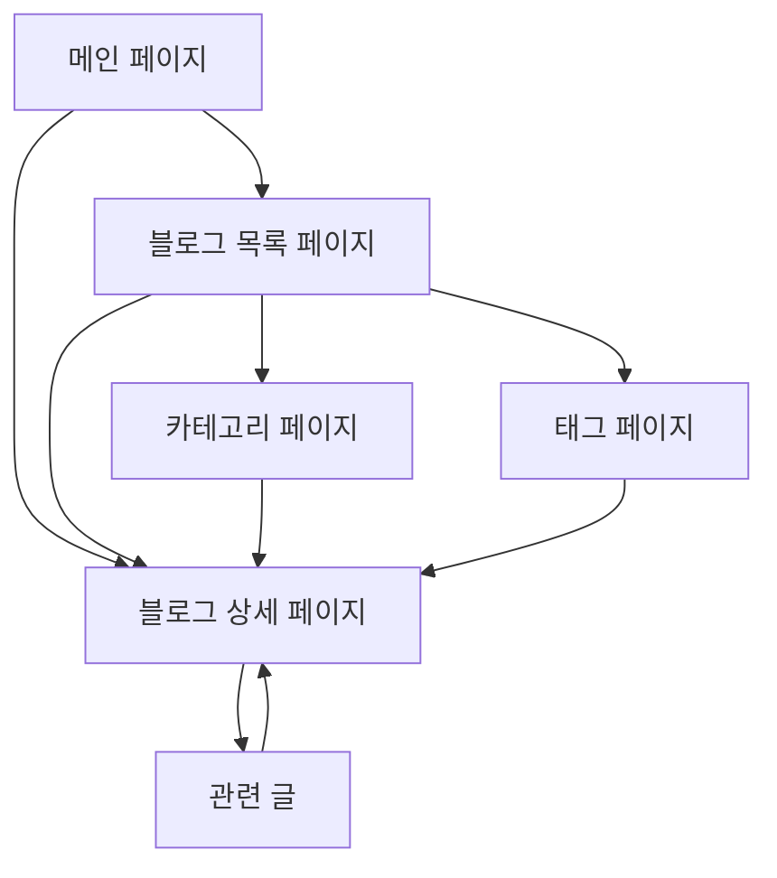

## 1. Product Overview

노션 데이터베이스를 활용한 모던 블로그 플랫폼으로, Linear.app에서 영감을 받은 미니멀하고 세련된 디자인을 제공합니다. 노션 DB의 콘텐츠를 실시간으로 동기화하여 블로그 포스트를 자동으로 관리하고, 개발자 친화적인 사용자 경험을 제공합니다.

## 2. Core Features

### 2.1 User Roles

이 프로젝트는 단일 사용자(블로그 운영자) 중심의 정적 블로그이므로 별도의 사용자 역할 구분이 필요하지 않습니다.

### 2.2 Feature Module

노션 DB 연동 블로그는 다음과 같은 주요 페이지들로 구성됩니다:

1. **메인 페이지**: 히어로 섹션, 최신 글 목록, 뉴스레터 구독
2. **블로그 목록 페이지**: 전체 포스트 목록, 카테고리 필터, 검색 기능
3. **블로그 상세 페이지**: 포스트 내용, 댓글 시스템, 관련 글 추천
4. **카테고리 페이지**: 카테고리별 포스트 목록
5. **태그 페이지**: 태그별 포스트 목록

### 2.3 Page Details

| Page Name          | Module Name     | Feature description                                              |
| ------------------ | --------------- | ---------------------------------------------------------------- |
| 메인 페이지        | 히어로 섹션     | 블로그 소개, 최신 글 강조 표시, CTA 버튼                         |
| 메인 페이지        | 최신 글 목록    | 노션 DB에서 최신 3개 포스트 가져오기, 썸네일/제목/요약/날짜 표시 |
| 메인 페이지        | 뉴스레터 구독   | 이메일 입력 폼, 구독 처리                                        |
| 블로그 목록 페이지 | 포스트 목록     | 노션 DB 전체 포스트 페이지네이션, 무한 스크롤                    |
| 블로그 목록 페이지 | 필터링 시스템   | 카테고리별 필터, 태그별 필터, 날짜별 정렬                        |
| 블로그 목록 페이지 | 검색 기능       | 제목/내용 기반 실시간 검색                                       |
| 블로그 상세 페이지 | 포스트 렌더링   | 노션 블록을 HTML로 변환, 코드 하이라이팅, 이미지 최적화          |
| 블로그 상세 페이지 | 메타데이터 표시 | 작성일, 수정일, 카테고리, 태그, 읽기 시간                        |
| 블로그 상세 페이지 | 관련 글 추천    | 같은 카테고리/태그 기반 추천 시스템                              |
| 카테고리 페이지    | 카테고리별 목록 | 특정 카테고리의 모든 포스트 표시                                 |
| 태그 페이지        | 태그별 목록     | 특정 태그의 모든 포스트 표시                                     |

## 3. Core Process

### 메인 사용자 플로우

1. 사용자가 메인 페이지에 접속
2. 최신 글 목록에서 관심 있는 포스트 클릭
3. 블로그 상세 페이지에서 포스트 내용 읽기
4. 관련 글 또는 카테고리를 통해 추가 포스트 탐색
5. 뉴스레터 구독 또는 소셜 미디어 팔로우

### 콘텐츠 관리 플로우

1. 노션 DB에서 새 포스트 작성
2. 포스트 상태를 'Published'로 변경
3. 웹사이트에서 자동으로 새 포스트 감지 및 표시
4. 빌드 시점에 정적 페이지 생성 (ISR 활용)

## 4. User Interface Design

### 4.1 Design Style

- **Primary Colors**:
  - Accent: `hsl(var(--accent))` (보라/파랑 계열)

  - Background: `hsl(var(--background))`

  - Foreground: `hsl(var(--foreground))`

- **Button Style**: 둥근 모서리, 호버 효과가 있는 모던한 스타일

- **Font**: 시스템 폰트 스택 (Inter, -apple-system, BlinkMacSystemFont)

- **Layout Style**: 카드 기반 레이아웃, 상단 고정 네비게이션

- **Icon Style**: Lucide React 아이콘 세트 사용

### 4.2 Page Design Overview

| Page Name          | Module Name   | UI Elements                                                    |
| ------------------ | ------------- | -------------------------------------------------------------- |
| 메인 페이지        | 히어로 섹션   | 대형 타이포그래피, 그라데이션 텍스트, CTA 버튼 2개             |
| 메인 페이지        | 최신 글 목록  | 3열 그리드 카드 레이아웃, 호버 애니메이션, 썸네일 플레이스홀더 |
| 메인 페이지        | 뉴스레터 구독 | 중앙 정렬 폼, 이메일 입력 + 버튼 조합                          |
| 블로그 목록 페이지 | 포스트 목록   | 반응형 그리드, 카드 기반 레이아웃, 페이지네이션                |
| 블로그 상세 페이지 | 포스트 내용   | 타이포그래피 중심, 코드 블록 하이라이팅, 이미지 최적화         |

### 4.3 Responsiveness

- **Desktop-first** 접근 방식

- **Mobile-adaptive** 디자인 (768px, 640px 브레이크포인트)

- **Touch interaction** 최적화 (모바일 호버 상태 처리)

- **Grid system**: CSS Grid와
