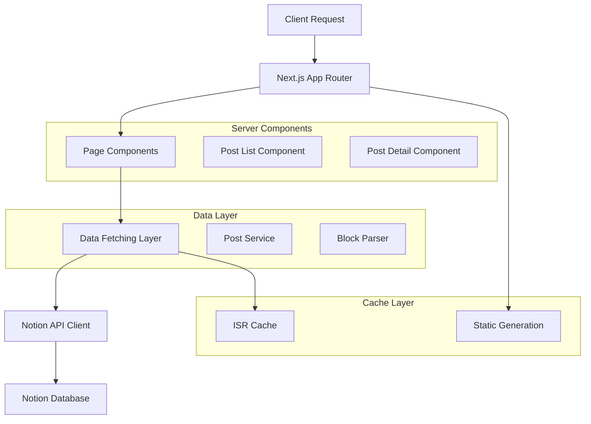
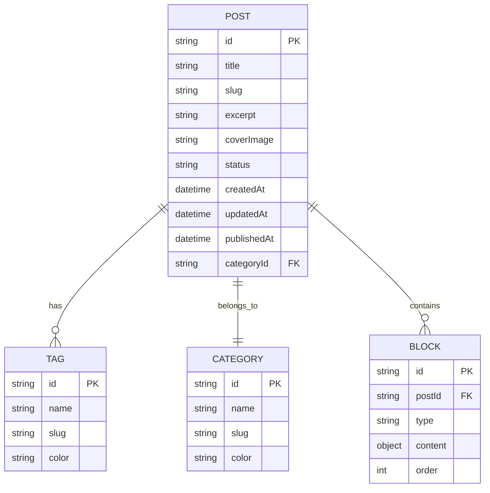

## 1. Architecture design

```mermaid
graph TD
    A[User Browser] --> B[Next.js Frontend Application]
    B --> C[Notion API]
    B --> D[Static Generation/ISR]
    C --> E[Notion Database]

    subgraph "Frontend Layer"
        B
        F[React Components]
        G[Notion Block Renderer]
    end

    subgraph "Data Layer"
        E
        H[Notion Blocks]
    end

    subgraph "External Services"
        C
    end

    subgraph "Build/Runtime"
        D
        I[Static Pages]
        J[ISR Cache]
    end
## 2. Technology Description

* **Frontend**: React\@19 + Next.js\@15 + TypeScript\@5.9 + Tailwind CSS\@3.4

* **Notion Integration**: @notionhq/client + notion-to-md + react-notion-x

* **Styling**: Tailwind CSS + Shadcn/ui + Radix UI

* **Code Highlighting**: prismjs 또는 highlight.js

* **Image Optimization**: Next.js Image component

* **Deployment**: Vercel (권장)

## 3. Route definitions

| Route                 | Purpose                    |
| --------------------- | -------------------------- |
| /                     | 메인 페이지, 최신 글 3개와 히어로 섹션 표시 |
| /blog                 | 블로그 목록 페이지, 전체 포스트 목록과 필터링 |
| /blog/\[slug]         | 블로그 상세 페이지, 개별 포스트 내용 표시   |
| /category/\[category] | 카테고리별 포스트 목록 페이지           |
| /tag/\[tag]           | 태그별 포스트 목록 페이지             |
| /api/revalidate       | ISR 재검증을 위한 API 엔드포인트      |

## 4. API definitions

### 4.1 Core API

**노션 데이터베이스 조회**

```

GET /api/posts

```

Response:

| Param Name | Param Type | Description  |
| ---------- | ---------- | ------------ |
| posts      | Post\[]    | 포스트 목록 배열    |
| hasMore    | boolean    | 추가 포스트 존재 여부 |
| nextCursor | string     | 다음 페이지 커서    |

**개별 포스트 조회**

```

GET /api/posts/[slug]

```

Response:

| Param Name   | Param Type | Description |
| ------------ | ---------- | ----------- |
| post         | Post       | 포스트 상세 정보   |
| blocks       | Block\[]   | 노션 블록 데이터   |
| relatedPosts | Post\[]    | 관련 포스트 목록   |

**ISR 재검증**

```

POST /api/revalidate

````

Request:

| Param Name | Param Type | isRequired | Description |
| ---------- | ---------- | ---------- | ----------- |
| secret     | string     | true       | 재검증 시크릿 키   |
| path       | string     | false      | 특정 경로 재검증   |

Example:

```json
{
  "secret": "your-revalidate-secret",
  "path": "/blog/example-post"
}
````

## 5. Server architecture diagram



## 6. Data model

### 6.1 Data model definition



### 6.2 Data Definition Language

**노션 데이터베이스 스키마 (Notion DB Properties)**

```typescript
// 노션 데이터베이스 프로퍼티 정의
interface NotionDatabaseSchema {
  // 기본 프로퍼티
  title: {
    type: 'title'
    title: Array<RichText>
  }

  // 커스텀 프로퍼티
  slug: {
    type: 'rich_text'
    rich_text: Array<RichText>
  }

  excerpt: {
    type: 'rich_text'
    rich_text: Array<RichText>
  }

  coverImage: {
    type: 'files'
    files: Array<File>
  }

  status: {
    type: 'select'
    select: {
      name: 'Draft' | 'Published' | 'Archived'
      color: string
    }
  }

  category: {
    type: 'select'
    select: {
      name: string
      color: string
    }
  }

  tags: {
    type: 'multi_select'
    multi_select: Array<{
      name: string
      color: string
    }>
  }

  publishedAt: {
    type: 'date'
    date: {
      start: string
      end?: string
    }
  }

  readingTime: {
    type: 'number'
    number: number
  }
}
```

**TypeScript 타입 정의**

```typescript
// 포스트 타입 정의
interface Post {
  id: string
  title: string
  slug: string
  excerpt: string
  coverImage?: string
  status: 'Draft' | 'Published' | 'Archived'
  category: Category
  tags: Tag[]
  createdAt: string
  updatedAt: string
  publishedAt: string
  readingTime: number
}

// 카테고리 타입 정의
interface Category {
  id: string
  name: string
  slug: string
  color: string
}

// 태그 타입 정의
interface Tag {
  id: string
  name: string
  slug: string
  color: string
}

// 노션 블록 타입 정의
interface NotionBlock {
  id: string
  type: string
  content: any
  children?: NotionBlock[]
}
```

**환경 변수 설정**

```bash
# .env.local
NOTION_TOKEN=secret_your_notion_integration_token
NOTION_DATABASE_ID=your_database_id
REVALIDATE_SECRET=your_revalidate_secret
```
